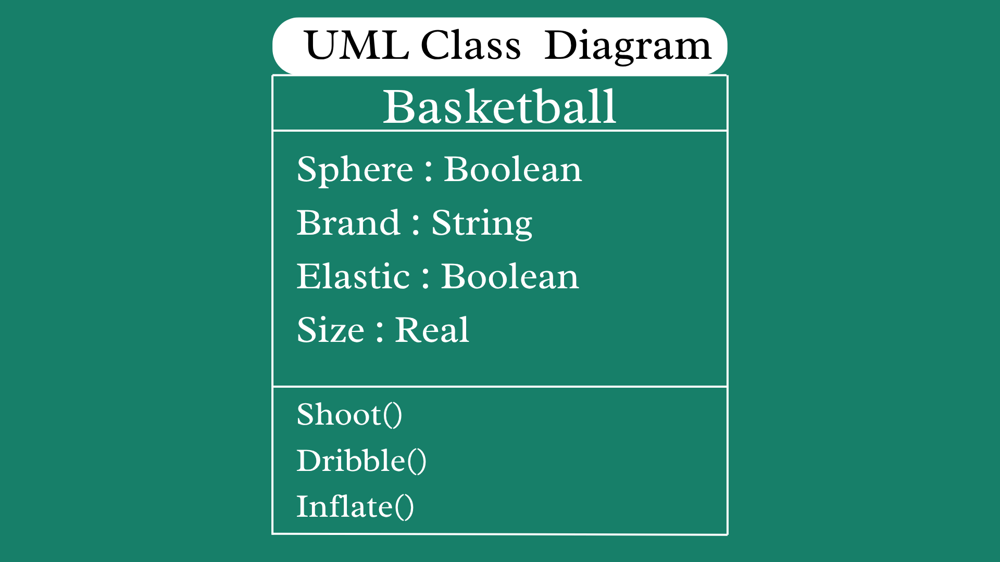

# SG4 - Understanding Classes and Objects

## Class Name
- Basketball

## Class Description
- My class is an object that represents one of the sports.

## Properties

| Property | Data Type | Description |
|---|---|---|
| Sphere | Boolean | The shape of the basketball. |
| Brand | String | Brand where the basketball is made. |
| Elastic | Boolean | The basketball can bounce. |
| Size | Real | The size of the basketball |

## Methods

| Method | Description |
|---|---|
| Shoot() | To shoot the ball. |
| Dribble() | To let the ball bounce. |
| Inflate() | To pump the ball with air. |

## Class Diagram

## Design Explanation

### Why did you choose this class?

- I choose this class because I know things about it.

### Which property is the most important? Why?

- The most important property is probably the sphere because if it is not a sphere then it is not a ball.

### Which method is the most useful? Why?

- The most useful method is probably inflate() because it makes the basketball useful and enable it to be dribbled and shot.
