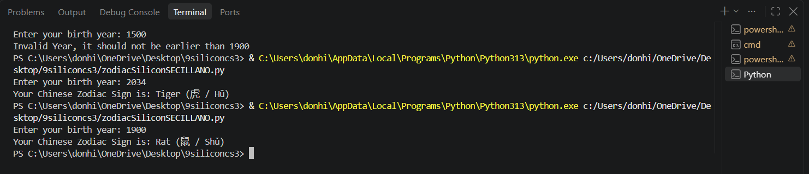

# Chinese Zodiac

**Name:** Don Hill R. Secillano

**Section:** 9-Silicon

**Date** August 20, 2026

# Task

Create a zodiacSectionLN.py file.  This file will contain your solutions to the requirements below:

a. Ask the user to enter a year of birth.  The baseline year 1900.
b. Validate user input that it should not be earlier than 1900.
c. If the user enters an invalid year then display an appropriate message then stop or abort the program.

Example:
Enter your birth year: 1800
Invalid Year, it should not be earlier than 1900

d. Otherwise determine the chinese zodiac sign based on the following starting from 1900.  Note: A zodiac sign will recur after each 12 years.

i. Rat (鼠 / Shǔ)
ii. Ox (牛 / Niú)
iii. Tiger (虎 / Hǔ)
iv. Rabbit (兔 / Tù)
v. Dragon (龙 / Lóng)
vi. Snake (蛇 / Shé)
vii. Horse (马 / Mǎ)
viii. Goat (羊 / Yáng)
ix. Monkey (猴 / Hóu)
x. Rooster (鸡 / Jī)
xi. Dog (狗 / Gǒu)
xii. Pig (猪 / Zhū)

e. CONSIDER only the year of birth.

Example input and output:
Enter your birth year: 2000
Your Chinese Zodiac Sign is: Dragon (龙 / Lóng)

## Code
```python
Birthyear = int(input("Enter your birth year: ")) 
if Birthyear < 1900:
    print("Invalid Year, it should not be earlier than 1900")

else:
    zodiac = (Birthyear - 4) % 12

    if zodiac == 0:
        print("Your Chinese Zodiac Sign is: Rat (鼠 / Shǔ)")
    elif zodiac == 1:
        print("Your Chinese Zodiac Sign is: Ox (牛 / Niú)")
    elif zodiac == 2:
        print("Your Chinese Zodiac Sign is: Tiger (虎 / Hǔ)")
    elif zodiac == 3:
        print("Your Chinese Zodiac Sign is: Rabbit (兔 / Tù)")
    elif zodiac == 4:
        print("Your Chinese Zodiac Sign is: Dragon (龙 / Lóng)")
    elif zodiac == 5:
        print("Your Chinese Zodiac Sign is: Snake (蛇 / Shé)")
    elif zodiac == 6:
        print("Your Chinese Zodiac Sign is: Horse (马 / Mǎ)")
    elif zodiac == 7:
        print("Your Chinese Zodiac Sign is: Goat (羊 / Yáng)")
    elif zodiac == 8:
        print("Your Chinese Zodiac Sign is: Monkey (猴 / Hóu)")
    elif zodiac == 9:
        print("Your Chinese Zodiac Sign is: Rooster (鸡 / Jī)")
    elif zodiac == 10:
        print("Your Chinese Zodiac Sign is: Dog (狗 / Gǒu)")
    else:
        print("Your Chinese Zodiac Sign is: Pig (猪 / Zhū)")
```

## Output
